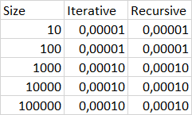

# Java Mentoring Program
## Effective Java

## Benchmarks

### Binary Search algorithms

Recursive and iterative binary searches are similar in processing speed. Recursive search is on average 10% faster than iterative search. On small data sets in some cases, iterative may be faster, but in general, recursive search is more efficient.

### Sort algorithms

Insertion sorting works faster on small data arrays than merge sorting, but starting from the array length of 1000 elements and more sorting by insertion sharply loses its efficiency, respectively on large data arrays it is better to use merge sorting.

